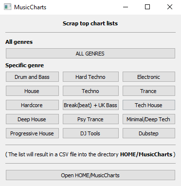

# musiccharts
(Python) GUI to easily scrap (electronic) music charts as csv files into your home dir/folder.

### Installation
1. Download [**MusicCharts**.exe](https://github.com/DustinScharf/musiccharts/releases/download/v1.0/MusicCharts.exe "Click here to download MusicCharts")
2. Run **MusicCharts**.exe  

**Download here:** https://github.com/DustinScharf/musiccharts/releases/download/v1.0/MusicCharts.exe _(Windows)_  

_*Linux, Mac, etc.: You can load this repository into your IDE/Editor like PyCharm or VSCode and start it from there_

### Usage

Press any button and get a chart list (with the genre specified on the button) 
into the directory `HOME/MusicCharts` as a csv file

### Someone have a TIDAL-API with search by track name function with just username+passord login?
Or is intrested in writing one in coop?  
In combination with this script, it would be an amazing for DJs (testing new sets).
